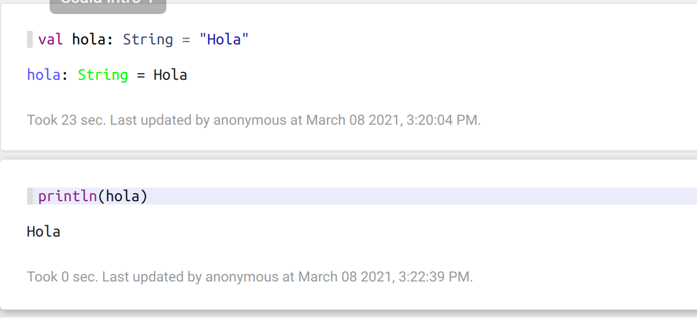
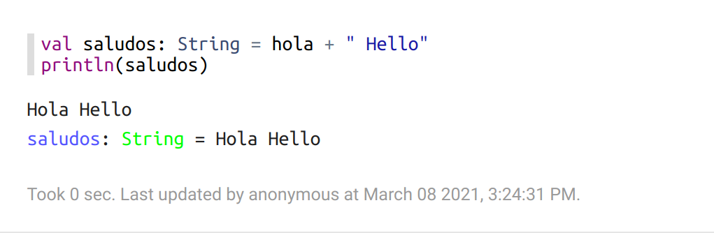
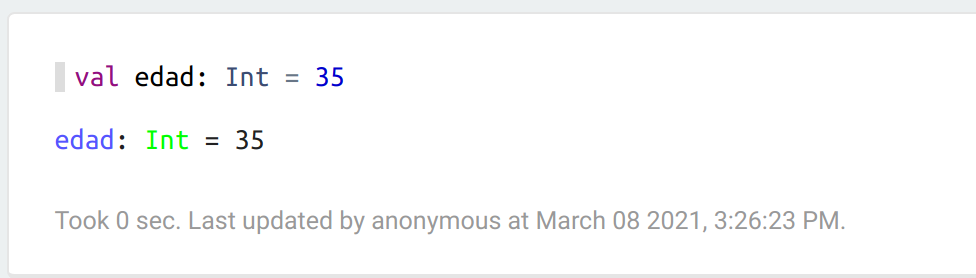
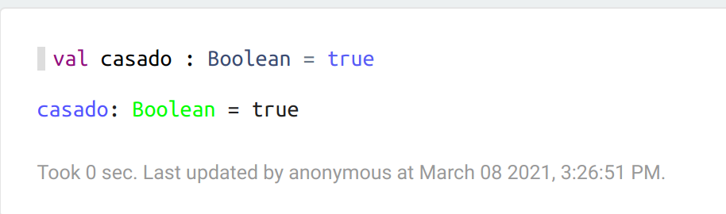
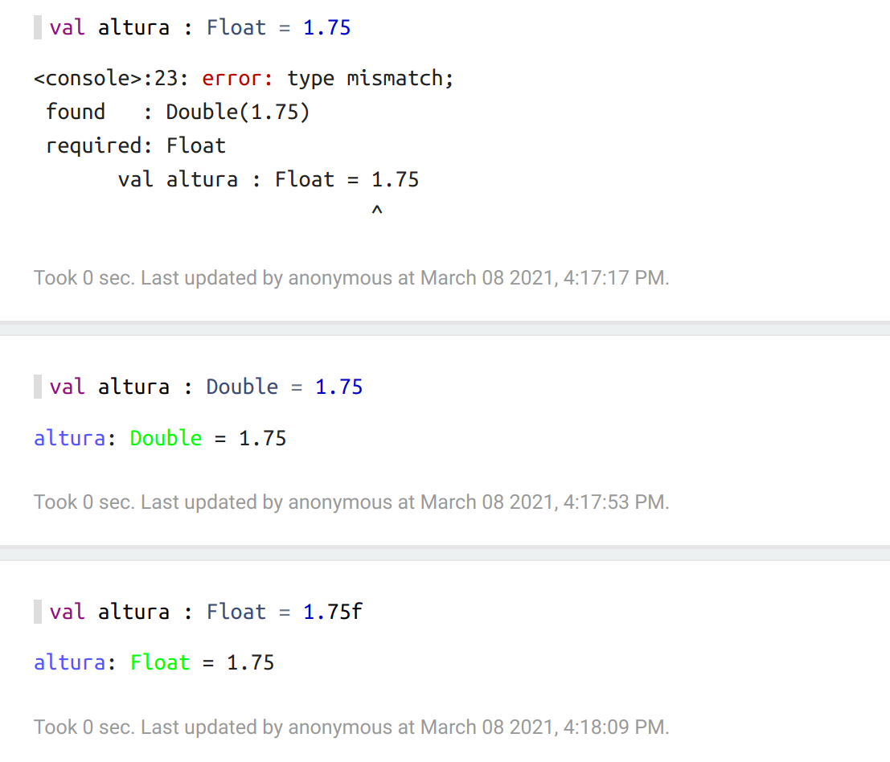
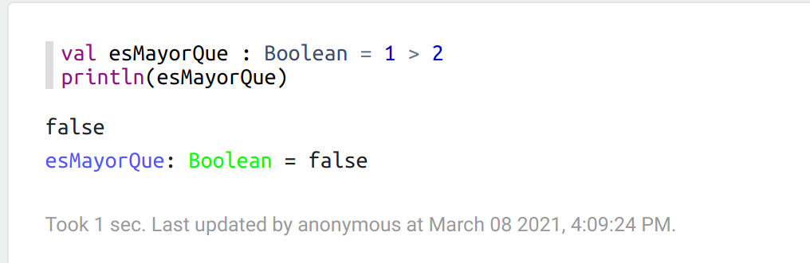
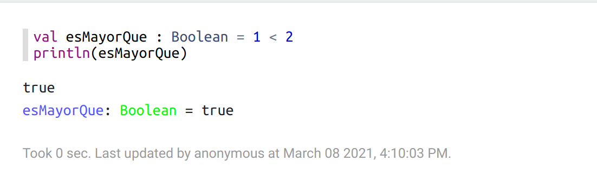

# Introducción

1. [Introducción ](#schema1)
2. [Instalacción](#schema2)
3. [Variables](#schema3)

# 1. Introducción
`Scala` es un lenguaje multi-paradigma y compilado. Soporta los paradigmas más importantes.
**Paradigma funcional:** Programación basada en funciones
**Paradigma POO:** Programación basada en programación orientada a objetos.

Es  lenguaje más potente para el tratamiento de datos masivos o Big Data.

# 2. Instalacción
1º Instalar Java:
Comprobamos que no tenemos ninguna versión de java instalada
~~~
java -version
~~~
Si tenemos instalada alguna versión perfecto, seguimos al siguente paso, sino:
~~~
sudo apt-get update
sudo apt-get install default-jdk
~~~
2º Instalar Scala
~~~
sudo apt-get install scala
~~~
Comprobamos que se ha instalado correctamente
~~~
scala
scala>println("Hello World")
~~~

Para salir del modo Scala REPL 
~~~
:q
~~~
3º Insalar Spark

4º Instalar Apache Zeppelin

  - Ir a http://zeppelin.apache.org/download.html y descargar la versio que ponga `all`
  - Descomprimir el archivo.
  -  Naverga en la terminal hasta donde se descomprimió el archivo.
  - y ejecutar  para comprobar que está funcionando
   ~~~
   bin/zeppelin-daemon.sh start
   ~~~
  

   
  - Comprobamos que el servidor web esta funcionando vamos a `localhost:8080` puerto por defecto.
  
  - Crear nuevo nota, ir a `Create new note` y ponerle el nombre que quieras. Y se nos abre un notebook nuevo
   

   - Para parar el servidor web
   ~~~
   bin/zeppelin-daemon.sh stop
   ~~~

# 3. Variables
**val nombre_variable : tipo_datos = valor**

~~~scala
val hola : String = "Hola"
~~~

**Concatenar**

~~~scala
val saludos : String = hola + " hello"
~~~
**Tipos de datos**

~~~scala
val edad : Int = 35
~~~

~~~scala
val casado: Boolean = true
~~~

En el caso del tipo de datos `Float` por defecto ponene `Double` que es el hermano mayor de los floats
Si los queremos `Float` al valor hay que añadirle una `f`
~~~scala
val altura : Float = 1.75
~~~

**Comentarios**

Para poner comentarios en `Scala` se usan las barras `//`
~~~scala
// otros tipos de variables : Float, Long, Char, Byte
~~~

**val nombre_variable : tipo_datos = expresión**

~~~scala
val esMayorQue : Boolean = 1 > 2
~~~

~~~scala
val esMayorQue : Boolean = 1 < 2
~~~

Enlaces 
Insatalación
(https://medium.com/@josemarcialportilla/installing-scala-and-spark-on-ubuntu-5665ee4b62b1)